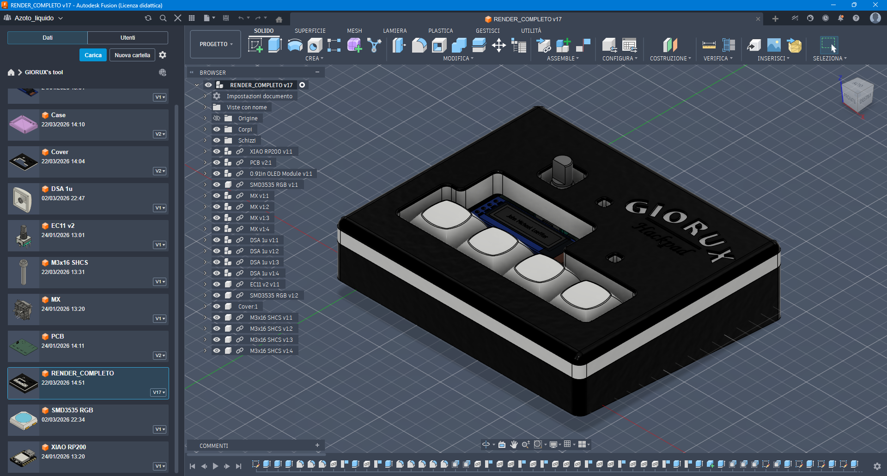
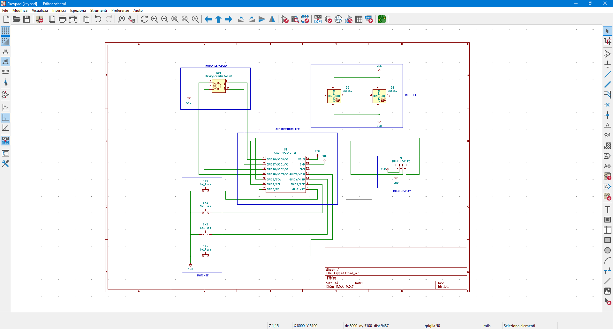
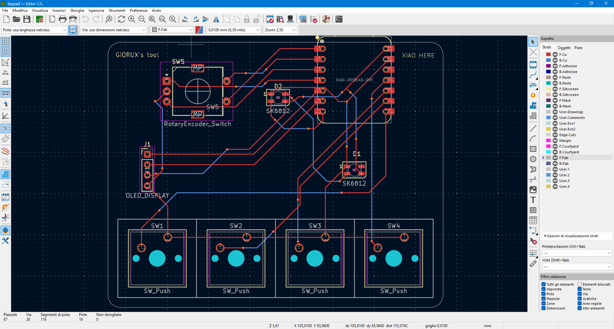

# Multi-function keypad
This is a 4 switches keypad with a rotary encoder and an OLED display, it has 2 LEDs and uses QMK Firmware.

I made it to learn a bit of this topic and I think it is perfect for general porpouse, everyday shortcuts and macros in gaming. Also in the little display you could write your name or a motd.

## Bill of Materials
- 4x Cherry MX Switches
- 4x DSA Keycaps
- 4x M3x16mm SHCS Bolts
- 2x sk6812mini LEDs
- 1x 0.91" 128x32 OLED Display
- 1x EC11 Rotary Encoder
- 1x XIAO RP2040
- 1x Case (2 printed parts)

## Cad
The 2 parts are held together with 4 M3x16mm SHCS Bolts without heatset inserts (the threads are cut directly into the plastic). The case has a 4 degrees titl for better ergonomics.

Made in Fusion 360.

## PCB

Schematic:

PCB:

## Firmware Overview
The firmware uses QMK Firmware and is fully configurable with VIA.
- The rotary encoder serves as a volume controller.
- The 4 keys can be assigned to any key with VIAA (https://caniusevia.com/).
- Holding down the 4th key will activate another layer in which the keys can be assigned to any other function.
- The OLED display can be assigned to display any text (Always in VIA).
- The 2 LEDs can display any color (This is done in VIA also).